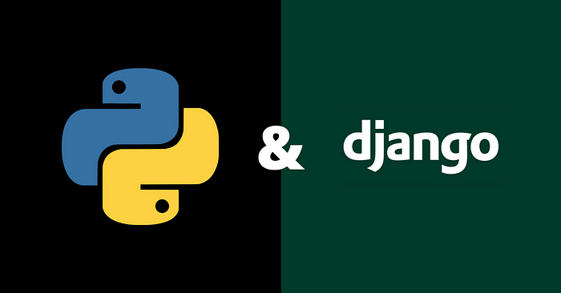

# Django Social Network



> A modern, secure social networking application built with Django following MVC architecture and best practices.

## Features

### **Advanced Authentication System**

- User registration with email verification
- Secure login/logout with email validation
- Token-based email verification with expiration
- Automated verification email resending
- Profile management with verification status

### **Social Features**

- **Post Creation** - Share thoughts and updates with the community
- **User Discovery** - Browse all registered users
- **Timeline Views** - View user-specific post feeds and activity
- **Recent Posts Feed** - See latest updates from all users

### **Security & User Experience**

- CSRF protection on all forms
- Email verification required before login
- Comprehensive logging for debugging and monitoring
- User-friendly error messages and success notifications
- Responsive Bootstrap-based UI

## Architecture

**Modular MVC Pattern** with clean separation of concerns:

```
api/
├── users/         # Authentication, user profiles, email verification
├── posts/         # Post management, timelines, social features
├── utils.py       # Reusable utilities (email services, helpers, mock)
└── settings.py    # Django configuration

main/
├── templates/     # Shared HTML templates
├── static/        # CSS, JS, fonts, icons
└── views.py       # Core application views
```

### **Key Components**

- **Email Service Layer** - Centralized email handling with error management
- **User Profile System** - Extended user model with verification tracking
- **Logging Framework** - Comprehensive logging for auth and application events
- **Template System** - Modular, reusable Django templates

## Quick Start

### Prerequisites

- Python 3.8+
- pip (Python package manager)

### Installation & Setup

```bash
# 1. Create and activate virtual environment
python -m venv venv
source venv/bin/activate  # Windows: venv\Scripts\activate

# 2. Install dependencies
pip install -r requirements.txt

# 3. Create/Update the .env file
# check "Configuration" instructions below

# 4. Set up database
python manage.py makemigrations
python manage.py migrate

# 5. Create admin user
python manage.py createsuperuser

# 6. Generate mock data (optional)
python manage.py create_mock_data

# 7. Run development server
python manage.py runserver
```

Visit `http://127.0.0.1:8000` to access the application.

## Usage

### Getting Started

1. **Register** - Create account with email verification
2. **Verify Email** - Check your email and click verification link
3. **Login** - Access your account after email verification
4. **Create Posts** - Share updates with the community
5. **Explore** - Browse user profiles and timelines

### Admin Panel

Access the Django admin at `http://127.0.0.1:8000/admin/` to:

- Manage users and profiles
- View verification status
- Monitor post activity
- Check application logs

## Tech Stack

### Backend

- **Framework:** Django 4.x
- **Database:** SQLite (development) / PostgreSQL (production)
- **Authentication:** Django Authentication System with custom extensions
- **Email:** Django Email Framework with SMTP support

### Frontend

- **UI Framework:** Bootstrap 5
- **Icons:** Font Awesome
- **Templates:** Django Template System
- **Fonts:** Roboto (Google Fonts)

### Development Tools

- **Logging:** Python logging with custom formatters
- **Static Files:** Django static files handling
- **Management Commands:** Custom Django commands for data generation

## API Endpoints

| Endpoint | Method | Description |
|----------|--------|-------------|
| `/` | GET | Home page with recent posts |
| `/register/` | GET/POST | User registration |
| `/login/` | GET/POST | User authentication |
| `/logout/` | POST | User logout |
| `/verify-email/<token>/` | GET | Email verification |
| `/resend-verification/<user_id>/` | GET | Resend verification email |
| `/user/<user_id>/timeline/` | GET | User timeline |
| `/create-post/` | POST | Create new post |

## Configuration

### Email Settings

Create a `.env` file for other developers:

```properties
# Django Configuration
SECRET_KEY=your-secret-key-here
DEBUG=True

# Database Configuration (PostgreSQL/MySQL)
DB_NAME=database_name
DB_USER=database_user
DB_PASSWORD=database_password
DB_HOST=localhost
DB_PORT=5432

# SQLite Configuration (Development)
SQLITE_DB_NAME=db.sqlite3
SQLITE_DB_PATH=./db.sqlite3

# Email Configuration (SMTP)
EMAIL_BACKEND=django.core.mail.backends.smtp.EmailBackend
EMAIL_HOST=smtp.gmail.com
EMAIL_PORT=587
EMAIL_USE_TLS=True
EMAIL_HOST_USER=your-email@gmail.com
EMAIL_HOST_PASSWORD=your-app-password
```

### Logging Configuration
Application logs are stored in the `logs/` directory:
- `auth.log` - Authentication events
- `debug.log` - Debug information
- `error.log` - Error messages

## License

MIT License - see [LICENSE](LICENSE) for details.

---
